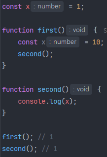

# 03_스코프(Scope)

> 변수나 함수가 유효할 수 있는 범위(스코프, scope) 혹은 실행 컨텍스트(Execution Context)

 

## 1. 함수 스코프 vs. 블록 스코프

> Functional Scope vs. Block Scope

### 1) 함수 스코프

어떤 변수가 함수 스코프를 가진다는 말은 해당 변수가 선언된 함수의 어떠한 코드 블록 내에서든 접근이 가능하다는 것을 의미한다.

`var` 키워드로 선언한 변수는 함수 스코프를 가지며, 해당 변수는 함수의 다른 부분에서도 접근 가능하다.

### 2) 블록 스코프

어떤 변수가 블록 스코프를 가진다는 말은 해당 변수가 선언된 코드 블럭 내에서만 접근이 가능하다는 것을 의미한다.

`let`과 `const`로 선언된 변수는 블록 스코프를 가지며, 해당 변수는 그 변수가 선언된 코드 블럭(중괄호, `{}`) 내에서만 접근 가능하다.

 

## 2. 렉시컬 스코프(정적 스코프) vs. 동적 스코프

> Lexical Scope(Static Scope) vs. Dynamic Scope

자바스크립트에서는 렉시컬 스코프를 따른다.

### 1) 렉시컬 스코프(정적 스코프)

함수를 어디에 선언하였는지에 따라 상위 스코프가 결정되는 것을 말한다. (= 함수를 어디서 호출하였는지는 스코프 결정에 아무런 의미를 주지 않는다.)

위 예시에서 각 함수의 호출 결과는 10, 1일 것 같지만, 둘 다 1이다.

그 이유는 second() 함수는 함수가 선언된 위치가 전역이기 때문에 상위 스코프가 전역으로 결정되어 있다. 따라서 x를 호출하면 전역 변수인 x를 참조하게 되어 1을 출력하는 것이다.

이는 second() 함수가 first() 함수 안에서 호출되더라도 자바스크립트에서는 렉시컬 스코프를 따르기 때문에 first()의 결과도 1이 출력되는 것이다.

### 2) 동적 스코프

함수를 어디에서 실행하느냐(호출하느냐)에 따라 상위 스코프가 결정되는 것을 말한다.

