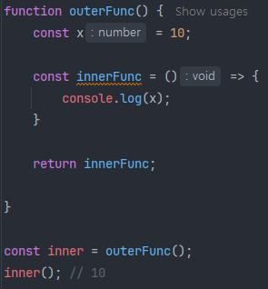

# 04_클로저(Closure)

> 자바스크립트의 클로저(Closure)

클로저(closure)란, 함수가 선언될 때 그 당시의 주변 환경과 함께 갇히는 것을 의미한다. 다른 말로는 함수가 선언될 때 그 함수의 스코프를 기억하는 기능을 말한다.

## 1. 렉시컬 스코프와 클로저

클로저의 개념은 렉시컬 스코프와 밀접한 관련이 있다.

- 렉시컬 스코프란 함수의 호출 시점이 아니라 해당 함수가 선언된(정의된) 위치에 따라 상위 스코프가 결정되는 것을 의미한다.

즉, 클로저란 **함수가 정의될 때 해당 함수의 렉시컬 스코프를 기억하여, 그 함수가 렉시컬 스코프 밖에서 실행될 때에도 이 스코프의 내용에 접근할 수 있게 해주는 기능**을 말한다.

위 캡처를 보면,

- 외부 함수인 outerFunc()을 먼저 정의하고, 그 안에 내부 함수인 innerFunc()을 정의하고 이를 반환하게 하였다.
- 그 후 inner라는 변수에 outerFunc()를 호출하여 저장하였다.

여기서 outerFunc()은 inner라는 변수를 선언할 때 호출된 다음 함수 라이프 사이클에 의해 종료되었지만, inner()로 호출 시 outerFunc()의 지역 변수인 x의 값을 기억하여 콘솔로 출력하고 있다.

이 개념이 바로 클로저이다.

즉, 클로저는 내부 함수가 자신이 선언되었을 때의 렉시컬 스코프를 기억하여, 이 후에 환경 밖에서 반환되어 호출되어도 그 환경에 접근할 수 있는 것을 말한다.

클로저 특성을 가지고 있는 함수를 클로저 함수라고 하며, 자신이 생성될 때의 렉시컬 스코프를 기억하고 있는 함수를 말한다.