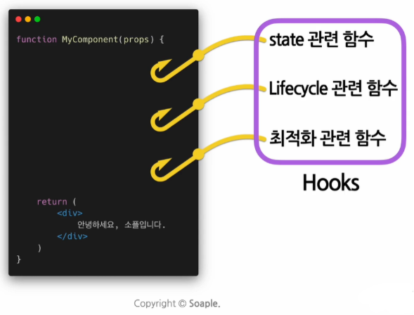

# 05_React Hooks

> 리액트 훅

## 1. Hooks?

> 훅이란?

### 1) 등장 배경

컴포넌트에는 크게 클래스 컴포넌트와 함수형 컴포넌트가 존재한다.

클래스 컴포넌트는 생성자에서 state (상태)를 정의하고, setState를 통해 상태를 업데이트하며 명확한 생명주기가 정의되어 있다.

반면 함수형 컴포넌트는 클래스 컴포넌트에 비해 코드가 간결한 대신에 별도로 state나 생명주기에 맞춰서 코드를 실행할 수 없었다. 이런 함수형 컴포넌트를 지원하여 state나 lifecycle 관련 기능을 사용할 수 있도록 나온 것이 바로 훅(Hooks)이다.

### 2) 유래

Hook은 한국말로 "갈고리"라는 의미를 가진다. 이러한 의미 그대로 훅이란 **어떤 기능을 갈고리처럼 끼어넣어 같이 실행되게 하는 것**을 의미한다.



즉, 리액트의 상태(state)와 생명 주기(life cycle) 기능에 갈고리를 걸어(Hook) 원하는 시점에 정해진 함수/기능을 실행하도록 만든 것을 훅이라고 한다.

### 3) use

훅의 이름은 모두 `use`로 시작한다. 이는 어떤 기능을 사용하겠다는 의미를 지니고 있다.

개발자가 자주 사용하는 함수나 기능을 훅으로 만들기도 하는데, 이 때의 훅을 커스텀 훅이라고 한다. 커스텀 훅의 명칭은 개발자가 마음대로 정의할 수 있지만, 보통 컨벤션은 use를 앞에 붙여서 훅이라는 것을 명시적으로 나타내주는 것이 원칙이다.

<br>

## 2. 대표적인 Hooks

### 1) useState

> 상태(state) 관리를 위한 훅

상태를 선언하고, 그 상태가 변할 때마다 재랜더링(리렌더링)하게 만드는 훅이다.

일반적으로는 다음과 같이 변수명을 정하고 set변수명으로 setter 함수를 정의한 다음 useState 안에 변수명의 초기값을 정의하여 사용한다.

```react
import React, { useState } from "react";

const [변수명, set변수명] = useState(초기값);
```

### 2) useEffect

> side effect (부수 효과)를 수행하기 위한 훅

리액트에서 말하는 사이드 이펙트란, 서버에서 데이터를 받아오거나 수동으로 DOM을 변경하는 등의 작업을 의미한다. 그러나 이 작업이 렌더링 중에 발생한다면 다른 컴포넌트에 영향을 끼칠 수 있기 때문에 **렌더링이 끝난 이후에 실행되어야 하는 작업들**을 말한다.

useEffect란 이러한 사이드 이펙트를 실행할 수 있게 해주는 훅이다.

```react
import React, { useEffect } from "react";

useEffect(이펙트 함수, 의존성 배열);
```

#### (1) 이펙트 함수

사이드 이펙트에 대한 내용을 담고 있는 함수를 의미한다.

즉, 렌더링 이후에 어떤 동작을 실행할지 정의해주면 된다.

#### (2) 의존성 배열

사이드 이펙트가 의존하고 있는 배열로, 배열 안에 있는 변수 중 하나라도 값이 변경이 발생하면, 사이드 이펙트 함수가 실행된다.

기본적으로 사이드 이펙트 함수는 처음 함수 컴포넌트가 렌더링 된 이후와 의존성 배열의 변수 업데이트로 인한 재렌더링 이후에 실행된다.

- 만약에 사이드 이펙트 함수를 최초 단 한 번만 실행되게 하고 싶다면, 의존성 배열을 빈 배열(`[]`)로 두면 된다. (정확히는 mount, unmount 시점에 각각 한 번씩 실행된다.)
- 만약 의존성 배열을 생략할 경우, 컴포넌트가 업데이트 될 때마다 사이드 이펙트 함수가 호출된다.

### 3) useMemo

> 연산량이 높은 작업의 반복적인 렌더링을 피하기 위해 미리 계산해둔 값을 사용하는 훅

Memoization(메모이제이션)이란 값을 기록해둔다는 의미를 가지고 있다. 연산 비용이 높은 함수의 계산 값을 미리 가지고 있다가 사용하는 최적화 기법 중 하나이다.

```react
import React, { useMemo } from "react";

useMemo(연산 함수, [의존성 변수1, 의존성 변수2, ...])
```

연산 함수는 의존성 변수를 사용하여 고비용의 연산을 수행하는 함수이다.

의존성 배열에 있는 의존성 변수가 변경되었을 때, 이 변수를 사용하는 연산 함수가 다시 호출되어 결과값을 반환한다.

useMemo() 훅을 사용하면 컴포넌트가 재렌더링 될 때마다 연산량이 높은 작업들을 반복하는 행위를 피할 수 있다.

#### (1) useMemo의 실행 시점

useMemo()의 훅으로 전달된 함수는 렌더링이 일어나는 동안 실행된다.

따라서 렌더링이 일어나는 동안 실행되어서는 안 되는 작업들(서버에서 데이터를 가져오거나 수동으로 DOM을 변경하는 사이드 이펙트들)은 useMemo 안에 넣으면 안 된다. 이러한 작업들은 반드시 useEffect 훅 안에서 실행되도록 해야 한다.

#### (2) 의존성 배열

useMemo() 훅이 최적화를 위해 고비용의 함수의 결과를 미리 계산한다고는 하지만 의존성 배열의 변수에 따라서 다시 수행될 수도 있다는 점을 기억하자.

- 의존성 배열 자체를 넣지 않고 생략할 경우, 매번 렌더링될 때마다 함수가 실행된다. 이렇게 되면 연산 비용을 줄이기 위해 사용하는 useMemo() 훅을 사용하는 의미가 없게 된다.
- 의존성 배열을 빈 배열로 둘 경우, 컴포넌트 마운트 시에만 호출된다. 즉, 컴포넌트가 마운트되는 시점에 딱 한 번만 계산이 필요한 경우 이렇게 사용할 수 있다.

### 4) useRef

> 레퍼런스(reference, 참조)를 사용하기 위한 훅

useRef()은 DOM 요소에 직접 접근하거나, 컴포넌트의 렌더링 사이에 값을 유지할 수 있도록 해주는 훅이다.

#### (1) 레퍼런스(reference)

레퍼런스란, 특정 컴포넌트에 접근할 수 있는 객체를 의미한다.

useRef() 훅은 레퍼런스 객체를 반환하며, 레퍼런스 객체에는 `current`라는 속성 값이 존재한다.

#### (2) current

현재 참조하고 있는 element의 값을 의미한다.

ref객체명이라는 형태의 변수로 선언하여 useRef() 훅 안에 초기값을 설정하여 사용한다. 그 후 참조 대상으로 정할 element의 ref 속성에 해당 변수명을 지정하여 사용한다.

```react
import React, { useRef } from "react";

const ref객체명 = useRef(초기값);
```

#### (3) 예시

useRef() 훅을 사용하여 버튼 클릭 시 input element에 접근하여 focus하도록 하는 코드

```react
const TextInputWithFocusButton = (props) => {
    const inputRef = useRef(null);
    
    const onButtonClick = () => {
        // currunt는 마운트된 input element를 가리킴
        inputRef.current.focus();
    };
    
    return (
        <div>
            <input ref={inputRef} type="text" />
            <button onClick={onButtonClick}>
                Focus the input
            </button>
        </div>
    );
}
```

#### (4) useRef의 라이프 사이클

ref객체는 useRef() 훅 안에 전달된 초기값을 갖고 있다가, 마운트 시 ref 속성으로 지정된 DOM element로 변경되고 나면 반환된 객체는 재렌더링이 발생하더라도 컴포넌트의 전체 수명 동안 (언마운트 직전까지) 유지된다.

```jsx
const inputRef = useRef(null);  // 1. 초기값: null

return <input ref={inputRef} />;  // 2. 마운트 시: DOM 요소로 변경
```

```tsx
// 타임라인
1️⃣ 컴포넌트 생성 (렌더링 전)
   └─ inputRef.current = null (초기값)

2️⃣ 마운트 (DOM 생성 후)
   └─ inputRef.current = <input> DOM 요소

3️⃣ 리렌더링 (여러 번 발생해도)
   └─ inputRef.current = 동일한 <input> DOM 요소 유지 ✅

4️⃣ 언마운트 직전
   └─ inputRef.current = 여전히 <input> DOM 요소

5️⃣ 언마운트 후
   └─ inputRef.current = null (React가 정리)
```

리턴 값이 변경되더라도 리렌더링이 발생하지 않고, 리렌더링이 되더라도 값이 변경되지 않기 때문에 setTimeOut과 같이 정확한 시간 계산이 필요할 때 사용할 수도 있다.